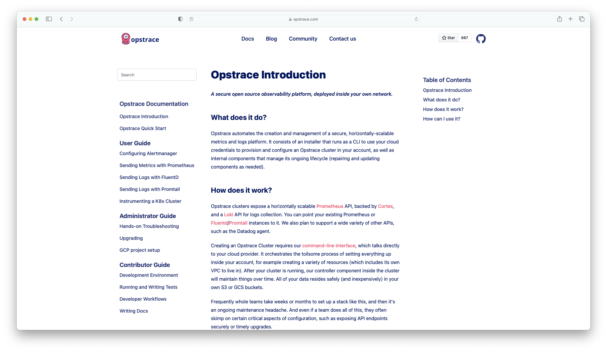

<p align="center">
  
</p>

<p align="center">
  <a href="https://github.com/opstrace/next-product-docs/actions/workflows/publish.yml"></a>
  <a href="https://github.com/opstrace/next-product-docs/actions/workflows/test.yml"></a>
  <a href="https://semantic-release.gitbook.io/semantic-release/"></a>
</p>

# Next.js Component for Product Docs

This component helps you to render your product documentation (`/docs`) on your
product website. Check out these docs to see a full impression what this
component does.

- [Opstrace Docs](https://opstrace.com/docs)
- [Cert Manager Docs](https://cert-manager.io/docs/)

Typically the website and product (docs) are in separate repositories. This
library offers three key functions:

1. `staticPaths` returns all available paths for static site generation in
   next.js
2. `pageProps` returns the required content such as sidebar routes, Table of
   Contents and Markdown
3. `Documentation` is a JSX function that contains the render function

You can read more about the whys and hows of this component in the
[Zentered Blog](https://zentered.co/articles/product-documentation-with-nextjs/)

## Prerequisites

The main purpose of this component is to fetch and render Markdown from a
different repo. In this folder you need to create a `manifest.json` file which
contains the link structure for the documentation you want to show. This allows
you to control the sidebar levels and titles for links.

Sample:

```
/docs
/docs/README.md
...
```

Manifest:

```json
{
  "routes": [
    {
      "heading": true,
      "title": "Next Docs Documentation",
      "routes": [
        {
          "title": "Introduction",
          "path": "/docs/README.md"
        }
      ]
    }
  ]
}
```

You can find
[complete example here](https://github.com/zentered/next-product-docs-example/blob/main/docs/manifest.json)
or check out the
[Example Documentation Manifest](https://github.com/zentered/next-product-docs-example/blob/main/content/mdx/manifest.json).

## Installation & Usage

In your Next.js website repo, run:

    npm install @zentered/next-product-docs

The location of your product docs can be configured through JSX properties. If
you want to access `docs` on a private repository, you'll need to provide a
`GITHUB_TOKEN` environment variable.

There are two possible ways to retrieve docs:

### Documentation in the same repository as the website

[In this example](https://github.com/zentered/next-product-docs-example/blob/main/pages/local/%5B%5B...slug%5D%5D.jsx),
the documentation content is stored in `content/docs/`:

```jsx
const defaults = {
  docsFolder: 'docs',
  rootPath: 'content'
}
```

### Documentation in a remote repository

[Another example](https://github.com/zentered/next-product-docs-example/blob/main/pages/remote/%5B%5B...slug%5D%5D.jsx)
where documentation content is stored at
`@zentered/next-product-docs-example/content/docs/`:

```jsx
  org: 'zentered,
  repo: 'next-product-docs-example',
  tag: 'main',
  docsFolder: 'docs',
  rootPath: 'content'
```

### Additional options

```jsx
skipPathPrefix: false
```

Can be used if the docs are not located in the root of the repository.

```jsx
  useMDX: true,
```

Switch from Markdown to MDX.

```jsx
  trailingSlash: false, // add a trailing slash to all pages
  assetsDestination: null, // use a CDN for assets
  debug: process.env.DEBUG === true
```

### Full Example "[[...slug.jsx]]

```jsx
import Head from 'next/head'
import { pageProps, staticPaths } from 'next-product-docs/serialize'
import Documentation from 'next-product-docs'

const docsOptions = {
  docsFolder: 'docs',
  rootPath: 'content'
}

export default function Docs({ title, source }) {
  return (
    <main>
      <Documentation source={source} />
    </main>
  )
}

export async function getStaticPaths() {
  const paths = await staticPaths(docsOptions)
  return { paths, fallback: false }
}

export async function getStaticProps(ctx) {
  const props = await pageProps(ctx, docOptions)
  return { props }
}
```

# Run Locally

## Setup

```bash
    # build dist folder
    pnpm build

    # create system-wide link to project folder
    pnpm link .

    # in the website/next project folder
    pnpm link @zentered/next-product-docs ../next-product-docs

    # for continous monitoring in next-product-docs
    pnpm watch
```

## Additional Components

For convenience we're providing two additional components that help you get
started with a sidebar and table of contents. They contain styling classes, so
you should customize them as you

- [Sidebar](https://github.com/zentered/next-product-docs-example/blob/main/components/Sidebar.jsx)
- [Table of Contents (TOC)](https://github.com/zentered/next-product-docs-example/blob/main/components/Toc.jsx)

You can modify the page `[[slug]].jsx` and pass on `sidebarRoutes` and
`tocHeadings`, which contain the (nested) routes for the sidebar and toc. We're
using `react-scroll` to highlight the current section of the page in the table
of contents. In the sidebar you can easily integrate search for example with
[Algolia React InstantSearch](https://www.algolia.com/doc/guides/building-search-ui/what-is-instantsearch/react/).

### Code Import

You can import code from external files:

```js file=./examples/hello.js

```

This only works when working with a local folder, not by fetching the docs from
a remote repository. Check out
[remark-code-import](https://github.com/kevin940726/remark-code-import) for
further information.

## Contributing

Considering contributing to next-product-docs? We'd love to work with you!

To start a local development environment, have a look at our
[example repo](https://github.com/zentered/next-product-docs-example) on how to
link/unlink the component in a Next.js project.

You can also ping us on Twitter [@zenteredco](http://twitter.com/zenteredco).
The only workaround we have at the moment is forking the repository, publish new
package versions to GitHub and install them in the Next.js project where we use
the component.

Please adhere to the [code of conduct](./CODE_OF_CONDUCT.md).

## Acknowledgements & Thanks

- [Next.js](https://nextjs.org) which showed us the approach of fetching and
  rendering docs from a remote repo (https://nextjs.org/docs and
  https://github.com/vercel/next.js/tree/canary/docs)
- [next-mdx-remote](https://github.com/hashicorp/next-mdx-remote) which allows
  us to load mdx/md content from anywhere
